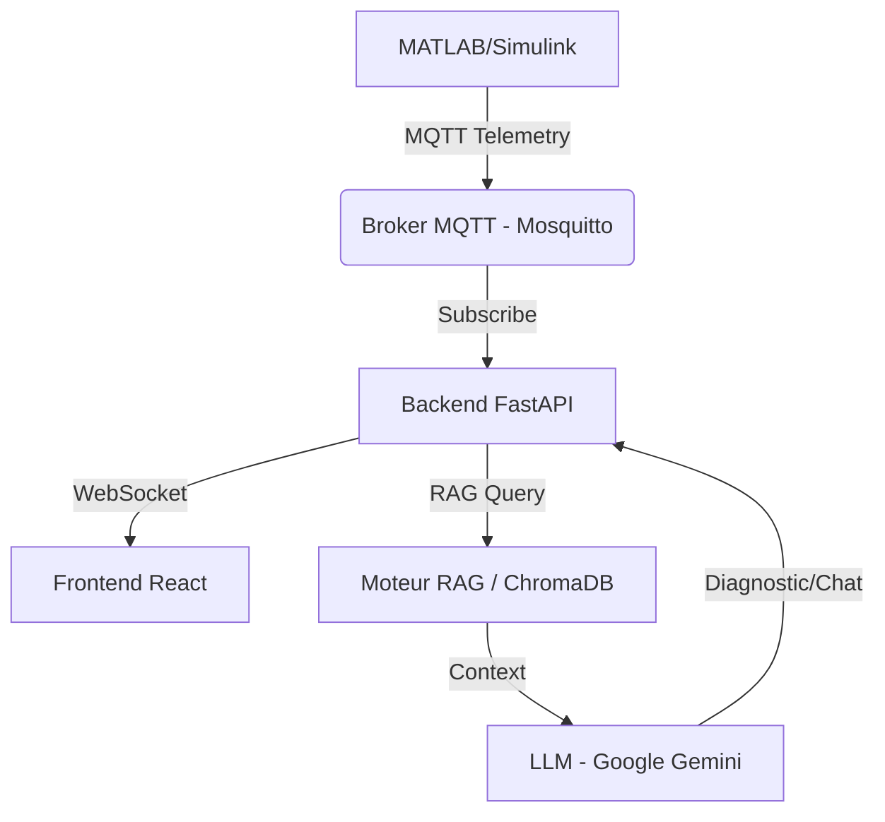

# Rapport de Projet : Jumeau Numérique Augmenté par IA Générative

## 1. Introduction et Objectifs

Ce projet vise à développer un **Jumeau Numérique (Digital Twin)** pour la maintenance prédictive d'une pompe centrifuge industrielle (Grundfos CR). L'innovation principale réside dans l'intégration d'une **Intelligence Artificielle Générative (GenAI)** utilisant l'approche **RAG (Retrieval-Augmented Generation)** pour fournir des diagnostics précis et contextuels basés sur la documentation technique du fabricant.

### Objectifs Clés :
- **Surveillance Temps Réel** : Visualisation des données capteurs (vibration, température, courant, etc.) via un tableau de bord interactif.
- **Simulation Physique** : Modélisation réaliste du comportement de la pompe et injection de défauts via MATLAB/Simulink.
- **Diagnostic Intelligent** : Analyse automatique des anomalies par un LLM (Google Gemini) enrichi par le manuel technique.
- **Assistance Technicien** : Chatbot spécialisé et génération dynamique de checklists de dépannage.

---

## 2. Architecture Globale

Le système repose sur une architecture modulaire connectant la simulation physique à une interface web moderne via des protocoles IoT standards.

### Schéma de Flux de Données :

### Composants Principaux :
1.  **Source de Données (Simulation)** : MATLAB/Simulink (ou simulateur Python de repli) génère la télémétrie et simule des pannes (cavitation, usure roulements, etc.).
2.  **Transport** : MQTT (Message Queuing Telemetry Transport) assure la transmission légère et temps réel des données.
3.  **Backend** : API REST et WebSocket développée avec **FastAPI** (Python).
4.  **Intelligence** : Agent IA orchestrant le RAG et les appels au modèle **Gemini 1.5 Flash**.
5.  **Frontend** : Interface utilisateur réactive en **React** (Vite) avec visualisation 3D.

---

## 3. Détail des Composants Techniques

### 3.1. Simulation et Télémétrie (MATLAB & Python)
- **MATLAB/Simulink** : Modèle physique simulant la dynamique de la pompe. Un script MATLAB (`mqtt_digital_twin.m`) publie les données capteurs toutes les 2 secondes sur le topic `pump/telemetry`.
- **Simulateur Python** (`src/simulator.py`) : Module de repli capable de générer des données réalistes et d'injecter 6 types de défauts progressifs (ex: déséquilibre de phase, chute de tension) si MATLAB n'est pas disponible.
- **Données Surveillées** : Courant (3 phases), Tension, Vibration, Pression, Température, RPM.

### 3.2. Moteur RAG (Retrieval-Augmented Generation)
Le cœur de l'intelligence du système réside dans sa capacité à consulter le manuel technique.
- **Ingestion** : Le manuel PDF (*Grundfos CR Pump Troubleshooting*) est découpé en "chunks" (segments de texte).
- **Embeddings** : Chaque chunk est converti en vecteur numérique via le modèle `text-embedding-004` de Google.
- **Stockage** : Les vecteurs sont stockés dans **ChromaDB**, une base de données vectorielle locale.
- **Recherche** : Lors d'une anomalie, le système convertit les symptômes en requête (ex: "high vibration cavitation") et récupère les extraits les plus pertinents du manuel.

### 3.3. Agent IA (`src/ai_agent.py`)
L'agent IA orchestre le processus de diagnostic :
1.  **Analyse** : Réception du snapshot des capteurs.
2.  **Construction de Requête** : Traduction des valeurs numériques anormales en termes sémantiques pour le RAG.
3.  **Augmentation** : Création d'un prompt contenant :
    - Le rôle (Ingénieur Senior).
    - Les données capteurs actuelles.
    - Les extraits du manuel récupérés (Contexte).
4.  **Génération** : Appel à l'API Gemini pour générer un diagnostic structuré (Diagnostic, Cause Racine, Actions Immédiates).

### 3.4. Interface Utilisateur (Frontend React)
- **Dashboard** : Jauges et graphiques temps réel (Recharts) pour chaque capteur.
- **Visualisation 3D** : Modèle 3D de la pompe intégré pour une meilleure immersion.
- **Panneau de Diagnostic** : Affichage clair du rapport généré par l'IA.
- **Checklist Dynamique** : Liste d'étapes de dépannage générée à la volée par l'IA, avec icônes et marquage des étapes critiques.
- **Chatbot** : Interface de discussion pour poser des questions techniques, avec mémoire de session et "Guardrails" pour rester dans le contexte de la maintenance.

---

## 4. Fonctionnalités Avancées

### 4.1. Checklist de Dépannage Dynamique
Contrairement à une liste statique, cette fonctionnalité s'adapte au problème spécifique détecté.
- **Processus** : Diagnostic -> Requête RAG spécifique ("procédure dépannage cavitation") -> Génération LLM d'une liste ordonnée -> Parsing JSON -> Affichage UI.
- **Sécurité** : Les étapes critiques (arrêt d'urgence, danger électrique) sont identifiées et mises en évidence visuellement.

### 4.2. Chatbot Contextuel avec Guardrails
- **Contexte** : Le chatbot "voit" l'état actuel de la pompe et a accès au manuel.
- **Guardrails** : Des filtres (mots-clés et sémantiques) empêchent le chatbot de répondre à des questions hors sujet (ex: "Quelle est la capitale de la France ?"), garantissant un usage professionnel.

### 4.3. Gestion de l'Arrêt d'Urgence
- Un bouton d'arrêt d'urgence dans l'interface permet de simuler une coupure immédiate.
- L'IA analyse cet événement et propose une procédure de redémarrage sécurisée.

---

## 5. Bilan et Perspectives

Ce projet démontre la faisabilité et la valeur ajoutée de l'intégration de l'IA Générative dans les processus industriels (Industrie 4.0).

**Points Forts :**
- **Autonomie** : Le système détecte et diagnostique sans intervention humaine initiale.
- **Précision** : Les réponses sont ancrées dans la documentation officielle (réduction des hallucinations).
- **Accessibilité** : L'interface rend des données complexes intelligibles pour les opérateurs.

**Améliorations Futures Possibles :**
- Intégration d'un historique de maintenance (GMAO).
- Déploiement sur le cloud pour une surveillance multi-sites.
- Affinement des modèles 3D pour montrer les pièces défaillantes en temps réel.

---
*Rapport généré le 17 Décembre 2025 basé sur l'état actuel du dépôt GitHub `digital_twin`.*
